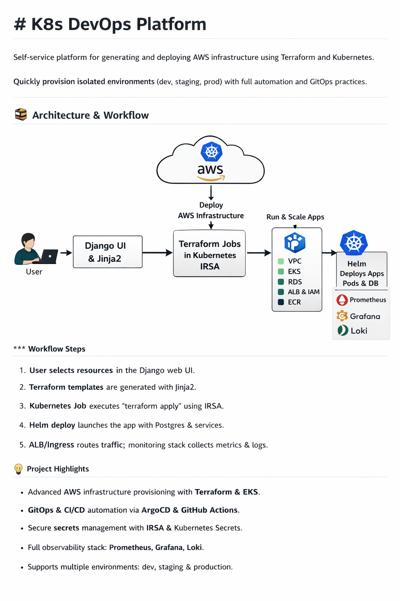

# K8s DevOps Platform

**Self-service platform for generating and deploying AWS infrastructure using Terraform and Kubernetes.**  

This platform empowers developers and DevOps teams to **quickly provision isolated environments** (dev, staging, prod) with full infrastructure automation, observability, and GitOps practices — all **without manually writing Terraform code**.

---

## 🚀 Features

- **Terraform-based Infrastructure as Code**  
  - Generate, plan, and apply AWS resources programmatically.  
  - Supports VPC, EKS, RDS, ECR, ALB, IAM roles, and more.

- **Kubernetes-native Deployment**  
  - Kubernetes **Jobs** execute Terraform `plan` and `apply` securely using **IRSA (IAM Roles for Service Accounts)**.  
  - **Helm charts** manage application deployment, secrets, and Postgres StatefulSets.  
  - Multi-environment deployments: dev, staging, prod.

- **Self-service Django UI + Jinja2**  
  - Interactive web UI to generate Terraform project templates.  
  - Users select resources and configurations; platform generates ready-to-use Terraform manifests.

- **GitOps + CI/CD Integration**  
  - Automated deployment pipelines with GitHub Actions.  
  - **ArgoCD** synchronizes Kubernetes resources from Git repository to cluster.  
  - Observability stack with **Prometheus, Grafana, Loki** for metrics, dashboards, and logs.

- **Secrets & Security**  
  - Sensitive information stored in **Kubernetes Secrets** or **GitHub Secrets**.  
  - Secrets are never pushed to Git; `.gitignore` protects all sensitive files.

---
## 🖼 Platform Overview




## 📁 Repository Structure
platform-app/ # Django backend + frontend + Jinja2 TF generator + Helm charts
platform-infra/ # Terraform bootstrapping (VPC, EKS, S3/DynamoDB, ECR, IAM)
tf-modules/ # Versioned Terraform modules (VPC, EKS, RDS, ALB, etc.)


- **platform-app**  
  - Web UI to generate Terraform templates.  
  - Helm charts for deploying services on EKS.  
  - Kubernetes Jobs to safely run Terraform.

- **platform-infra**  
  - Terraform for provisioning the platform itself.  
  - Creates VPC, EKS cluster, S3 buckets, DynamoDB tables, ECR repos, IAM roles.

- **tf-modules**  
  - Modular, reusable Terraform code for AWS resources.  
  - Versioned for safe updates and environment isolation.

---

## ⚡ Getting Started

1. Configure AWS CLI with your sandbox or dev account.  
2. Clone this repository and connect your local project to GitHub.  
3. Install dependencies for Django backend:

```bash
cd platform-app/backend
pip install -r requirements.txt

4. Initialize Terraform for bootstrapping the platform:

cd platform-infra
terraform init
terraform plan
terraform apply

5. Start Django UI to generate Terraform templates:

cd platform-app/backend
python manage.py runserver

6. Deploy generated infrastructure using Kubernetes Jobs and Helm charts.
7. Monitor environments via Prometheus/Grafana dashboards.

📌 Key Technologies

| Layer            | Tools & Technologies                     |
| ---------------- | ---------------------------------------- |
| Backend & UI     | Django, Jinja2, Python                   |
| IaC              | Terraform, Terraform Modules             |
| Containerization | Docker, Kubernetes, Helm                 |
| AWS Services     | EKS, VPC, RDS, DynamoDB, ECR, ALB, IAM   |
| CI/CD & GitOps   | GitHub Actions, ArgoCD                   |
| Observability    | Prometheus, Grafana, Loki                |
| Security         | Kubernetes Secrets, IRSA, GitHub Secrets |


✅ Highlights

Self-service Terraform generation – no manual TF coding required.

Secure, Kubernetes-native Terraform execution with IRSA.

Multi-environment support – dev, staging, production.

GitOps + CI/CD automation – fully reproducible deployments.

Integrated observability & monitoring stack from day one.

